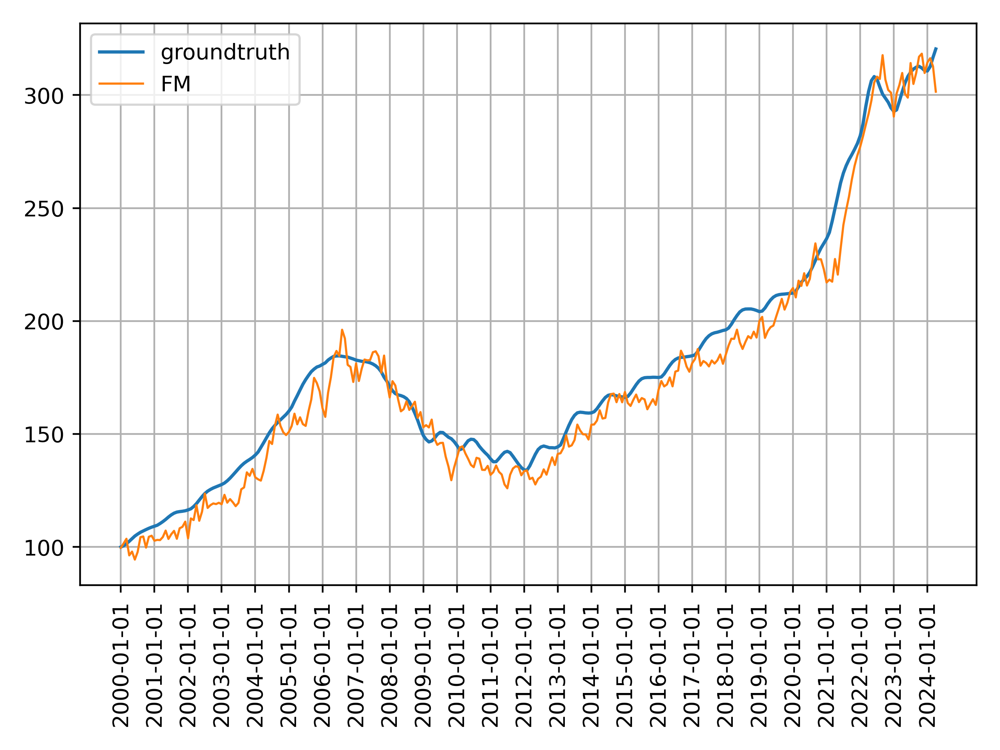

# Introduction

Here is the overall framework of project 1, abbreviated as P1.

P1 requires me to predict a given index using whatever public FRED datas. 
Actually it has two key points. 
1. The first is a framework to combine factors for predicting signals in whatever research scenarios. 
Basically it needs five consecutive parts as cleaning factors, selecting factors, preprocessing factors, combining factors using a customized ML&DL based model and backtesting signal.
Extra modules like assembling long and short-term signals are not included here since they are not essential functions during the pipline from factors to signals.
2. The second is to improve each part as good as possible.

Since the designed model structure is personalized for different data and problems,
I will give some common models here. More advanced models will be given in the future.

## Content
1. 0data_download.py for downloading the needed datas including the target _S&P/Case-Shiller
U.S. National Home Price Index_
2. 1data_clean.py for cleaning raw factors
3. 2factor_select.py for selecting factors with linear prediction ability in factor pool
4. 3data_preprocess.py for changing the distribution of given datas according to the prior expert knowledge
5. 4factor_combine.py for combing factors using machine or deep learning models to output a signal for position allocation, a.k.a. portfolio optimization
6. 5signal_backtest.py for backtesting the predicted signal using corresponding metrics

# Run the code
Run the .py files step by step from 0 to 5 according to the number in the script name.

# Download datas
Here I use a third-party package called fredapi based on the official API document
to download datas from FRED.

Target is clear and its ID in Fred is CSUSHPINSA.

As for factors, the guidance file, QR.pdf, says I should use whatever relevant datas in Fred.
Therefore I propose some keywords that I believe have correlations with home price like house and rent.
Then I search datas that contain these keywords to make sure the obtained data has fundamental logic with the target variable.
Since there are too many indicators after searching and the target is a month-frequency data, 
I just keep the indicators with the same update frequency and filter out the others.
It is worthy mentioned that this filter way is not the best since some datas in other frequency have great prediction ability for target.
The reason I do this is just to avoid too much data and simplify this problem.
And if it is essential to use more high-frequency indicators like daily updated indicators, 
please let me know and I will provide the method to introduce such different frequency indicators.
                                                                                                                                                
The final keyword list is _house_, _rent_, _home_, _family_ and _income_.

Since the indicators are still too many, 
I further filter out part of them by the following two rules.
The first rule is deleting the indicator whose popularity is less than 3.
The second one is deleting the indicator whose starting time is after January 1987, 
cause the target begins from this time point.

# Clean datas
I use forward filling and 0 to inplace nan or inf value.

# Select factors
1. Selecting features is to find out who has linear prediction ability for the target.
It is worthy mentioned that some features do not have direct prediction ability for the target 
which means their correlations with the target is close to zero. 
But they have some significant explanatory meanings 
and often describe some characteristics of the target with some fundamental logics.
Droping such kinds of features looks not to be the best way to use them and 
there are some alternative methods like feeding them into a model with nolinear extracting ability may works.
Here, I just use a strict way to select factors by just remaining the one 
with weak or strong prediction ability by setting up a threshold of IC. 
2. Then to avoid high correlation between factors, 
I design a rule to further filter out some indicators 
with high correlation with others by the correlation matrix. 
3. What's more, since the target is a stable time series variable, to ensure the stability of the signal output by the deep model, 
I do not want the factor that changes too drastically in time series. 
Therefore, I customize a selection method similar to Sharpe Ratio idea
to limit its maximum standard deviation after de-meaning the factor.

Statistics on all historical period data will introduce out-of-sample information, 
so I use statistical information before 2000 and start predicting targets from that time.

By the way, in this step, I do a shift operation of Dataframe data to avoid using look-ahead information.

One additional point is I use the indicators directly downloaded from FRED. 
Auctually, in most research problem, QR needs to design some personlized factors using the price and volume datas of market.

# Preprocess factors
This step is to change the distribution of datas like z-score for alpha signal.

In this project, actually it is a time series forecasting problem, also known as beta signal.
Therefore I divide each feature by its initial value to de-mean features.  
Using initial value is because of avoid look-ahead information.

What's more, to address some outliers shown in the following figure, 
I use the standard deviation of the previous observation datas during past 12 months 
to limit the current observation, 
which ensures that the factor changes continuously.

Such sudden variation in this figure is not good for some complex model like MLP 
because this kind of model is sensitive to changes in the input data.
Therefore this cut-off operation is helpful to smooth factors and train a more stable model.

# Combine factors

There are four important things in training a model to combine factors.
1. The first one is model structure, a.k.a. model itself.
2. The second one is how to divide train/valid/test dataset.
3. The third one is to make sure the input features are clean and effective, 
which means noisy features and someone without prediction ability should not be fed into model.
4. The last one is model ensemble. 
A famous saying I do agree is a fund is nothing more than a big ensemble model.

As for the first aspect, I design six models, 
which are linear regression(OLS), decision tree(lightgbm) and neural network(MLP,FM,GRU and Transformer).

As for the second one, I use the traditional way to split 
that is using the recent datas as valid dataset.
In fact, such split way is not the best way for stock or future market.
Because finance datas are particularly different with a lots of market states varying the time. 
This fact means that datas don't follow the iid distribution.
With such kind of multi-state market, a more advanced spliting way is 
using recent and some random past datas as valid dataset.
This operation is helpful for valid dataset to contain multiple market states and avoid overfitting.
However in this project, I use the most common way that is just using the recent data as valid dataset, 
Because the target has a strong autocorrelation.

By the way, something different in other industries except quant is the hyperparameter.
If a QR pays much time in finding out the best hyperparameter, 
even he makes it, it has a big probability of overfitting.
Because he finds something good for his tarin and valid datasets rather than the market.
This is really different in other industries since 
they will pay lots of time in for-loop based searching progress for best hyperparameter.
Therefore, if a model works well under some kinds of not bad hyperparameters without too much for-loop searching, 
such model is what we want. 
Because such model is not sensitive to hyperparameter 
which means it can avoid overfitting.

The training process follows a rolling way and the model is retrained per month.

As for the neural network based model, normally a mini-batch based training is used like 1024 samples in one optimization.
However here the data size is small thus directly using all samples is suitable for such training situation.

I don't use IC as the validation metric although it's a common one, MAE is used here. 
The most important reason is it is not an alpha research and we need to predict the accurate value of target.

I use EMA operation to smooth deep model based signals.
And in production, the common way to smooth deep model based signals is 
assembling a set of models.
Here since the target has high autocorrelation, EMA operation is reasonable in such situation.

# Backtest signals
I calculate three performance metrics to evlaute the signal. 
They are IC, MAE and RMSE.

And I also plot the price predicted by different models as

Some findings are as follow.
1. OLS performs best. This result is a little bit different with our common sense.
Because mostly lightgbm or more complex model is better. 
The reason is that factors in this project have strong linear prediction ability which means their ICs with target are really high like 0.8. 
And in stock alpha research, if a factor with IC 0.05 is even a really great indicator.
Therefore strong factors are more suitable for simple and linear model, a.k.a. OLS.
Another reason is that I use factor selection module to make sure the left factors have not too high correlation 
,which is also good for OLS model since multicollinearity is harmful for linear regression.
2. Lightgbm outputs the most stable signal, which means low turnover.
This finding is consistent with what we usually know since lightgbm has the strongest ability to deal with outlier datas.
3. Signals from neural network based model have bigger volatility and show a bias.
   1. The phenomenon that deep model is not stable is common  and appears in other research problem too.
   The reason why thay are not stable is that DL based model is more likely to overfit and be sensitive to hyperparameters, 
   especially factors in this problem do have strong linear prediction ability.
   The solutoin to improve this problem of DL based models is using model assemble. 
   Here I use EMA operation to get a stable signal.
   2. When the product keeps rising, the y in the training set is smaller than the future true value, 
   which will cause a bias in the neural network. 
   This problem can be solved by increasing the number of training samples. 
   I don't deal with it here because correcting the bias has some small tricks, 
   so I don't consider it for the time being.
4. The factors used in this project is so strong 
that different models appear not too much differences.
In fact, two ways are best for combing factors. 
One is very strong factors with a simple model.
The other is general factors with a complex model like Transformer.