# Introduction

Here is the overall content of project 2, abbreviated as P2.

P2 requires me to predict the correlation of GOOG, AMZN, JPM, GME, and XOM with the SPY index. 
Actually it also has two key points. 
1. The first is the framework proposed in project 1. 
I use the same rolling way to train the model and do this research.
There are two different things. 
   1. The first is the target predicted in P2 is the IC for the next two months, 
   which means that the data for the last two months before day T 
   cannot be used for training on day T to avoid using look-ahead informations. 
   It is a challenge.
   
   2. The second point is that the factors here are designed by myself, 
   all of them are based on correlation operation. ALl of them range from -1 to 1, 
   which means no outliers or extreme value.
   Therefore there is no factor preprocessing after cleaning.

2. The second is to design some suitable factors for the prediction of future correlation. 
It is intuitive to think of designing some kinds of correlation based factors, 
like the correlation of their past daily return.

## Content
1. 0data_download.py for downloading the needed datas from Yahoo Finance.
2. 1data_clean.py for cleaning raw factors
3. 2factor_mine_and_select.py for mining and selecting factors with linear prediction ability
4. 3factor_combine.py for combing factors using machine or deep learning models
5. 4signal_backtest.py for backtesting the predicted signal using corresponding metrics

# Run the code
Run the .py files step by step from 0 to 4 according to the number in the script name.

# Download datas
Following the guidance file, QR.pdf, I download 
the historical datas of five given stocks from Yahoo Finance.

For each day, I calculate IC between each stock and SPY index 
for the next 40 days.

# Clean datas
I use forward filling and 0 to inplace nan or inf value.

# Mine and Select factors
I use the correlation of statistical characteristics of different periods in the past as factors. 
These statistical characteristics include price, daily return, standard deviation, kurtosis, etc.

Then to keep the factors with prediction ability, 
I use the same single factor test and correlation between factors 
to select some factors with prediction ability and low correlation.

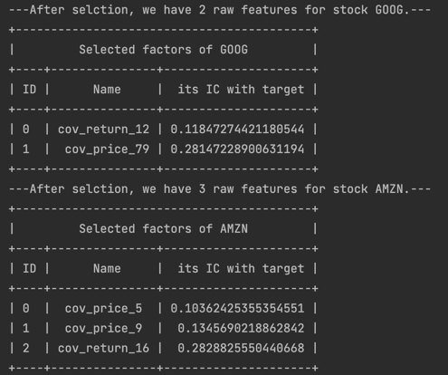

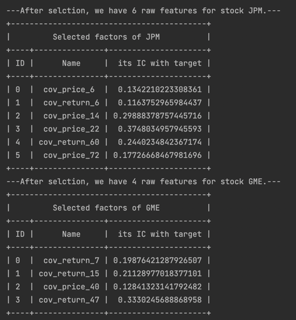

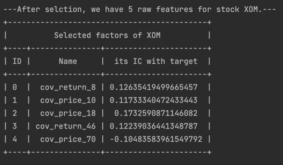

[//]: # (# Preprocess factors)

[//]: # (I use rolling operation to smooth factors. )

[//]: # (The reason is the same with that in P1.)

# Combine factors

I use six models, which are linear regression(OLS), decision tree(lightgbm) and neural network(MLP,FM,GRU and Transformer),
to learn correlation.
Each stock has a individual model.

The training process follows a rolling way and the model is retrained per day.

I use MAE as the validation metric 
because I want to predict the accurate value of their future correlation.

Since the target ranges from -1 to 1, I use Tanh as the activation function of deep model.

By the way, I also tried to use rolling or log operations 
to make the factors and targets smoother, which seems beneficial for model training. 
But the experimental results showed that there seemed to be no difference, 
so here I directly use the original values of the factors and targets.
# Backtest signals
Here to smooth the signal, I use rolling operation for all predicted signals.
I calculate three performance metrics to evlaute the signal. 
They are IC, MAE and quantiles of error.
The bigger the IC, the better.
The smaller the MAE and quantile, the better.

Then to obtain the best model, 
I add the outputs of the two models with maximum IC and minimum MAE to get the final signal.
The purpose of this is that with different models learning different patterns, 
it is better to combine them to obtain a model with better out-of-sample generalization performance.

1. GOOG
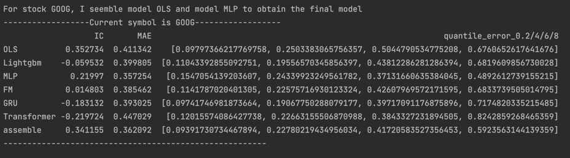
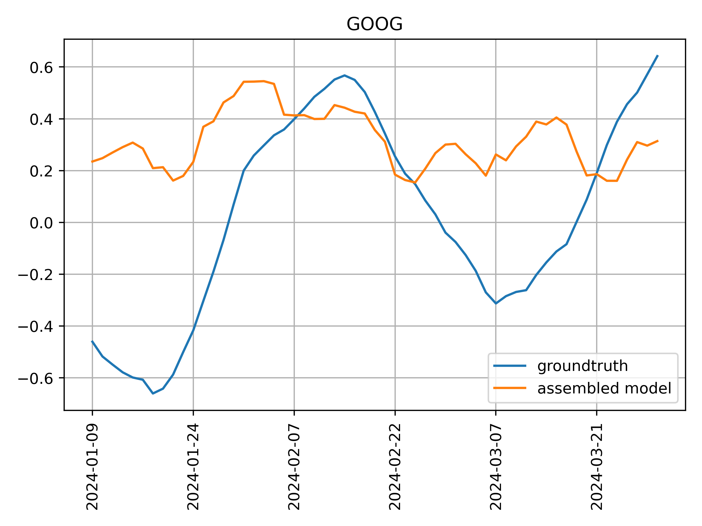
2. AMZN
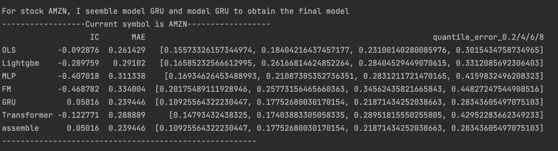
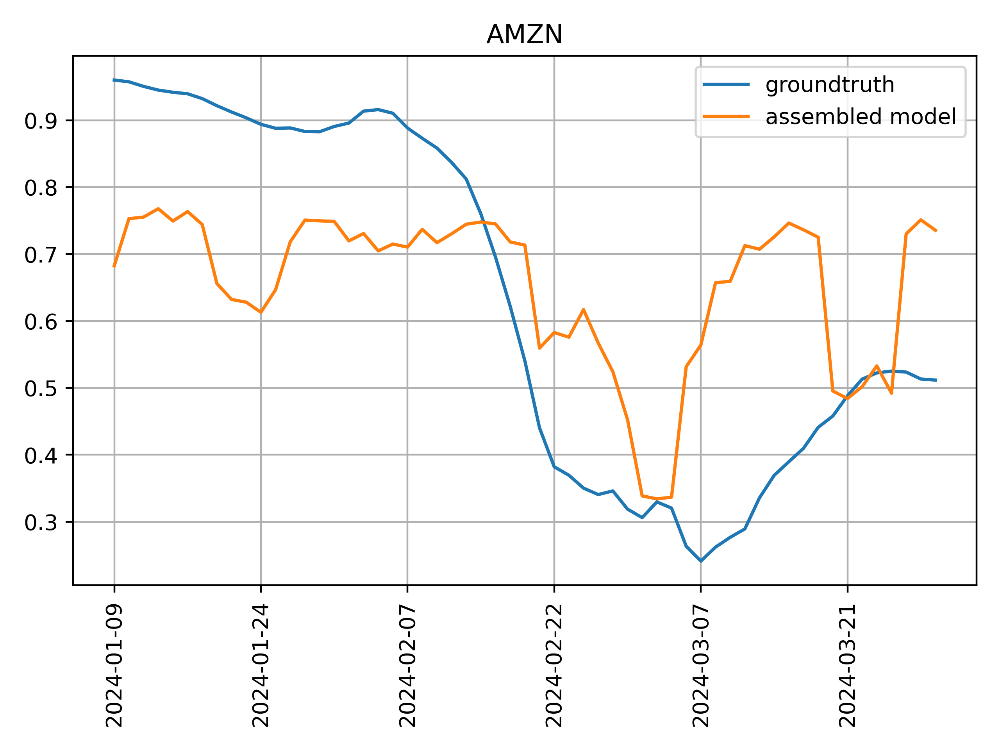
3. JPM
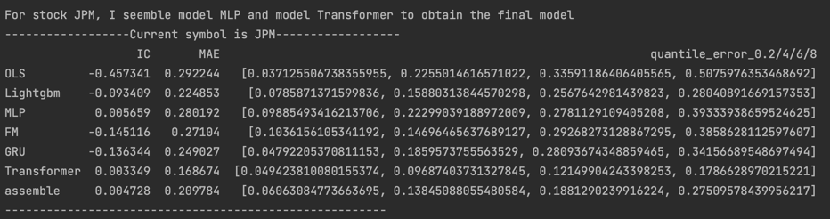
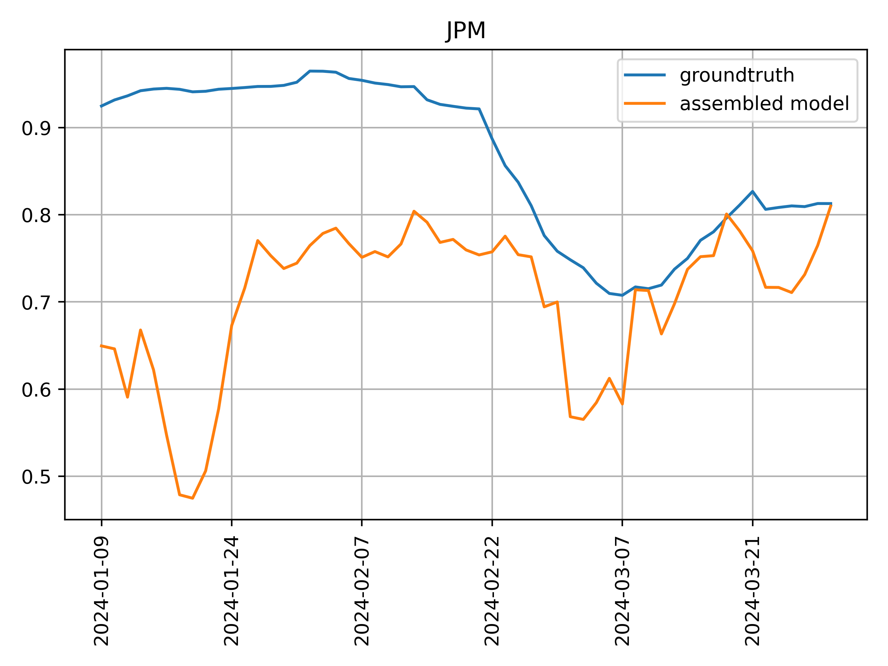
4. GME
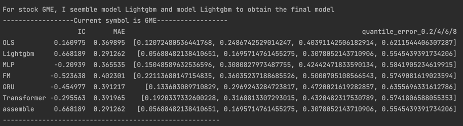
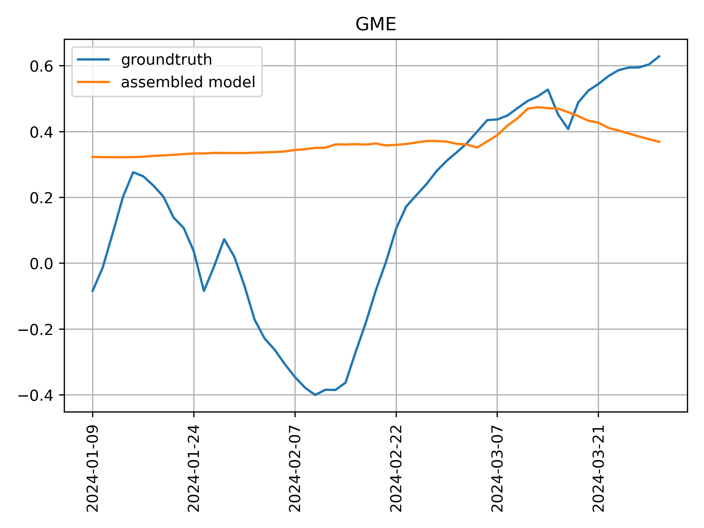
5. XOM
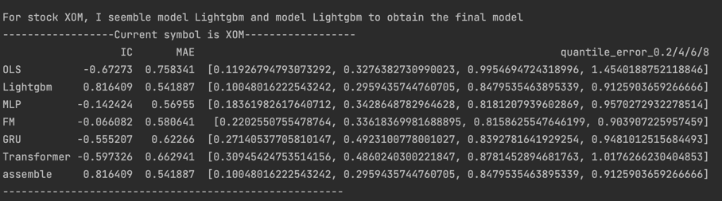
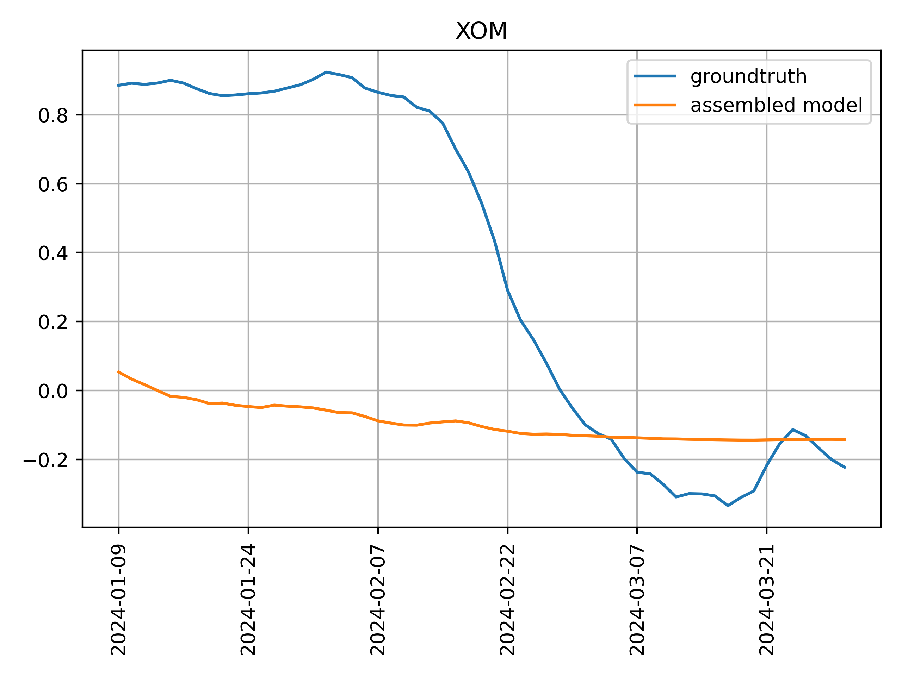

Some findings are as follow.
1. After the model combination, some of them show an increase in IC or a decrease in MAE.
What's more, the signal will be more stable. 
Here I give the prediction of a single model for GOOG. 
By comparison, it is easy to see the signal of the combined model is more stable.
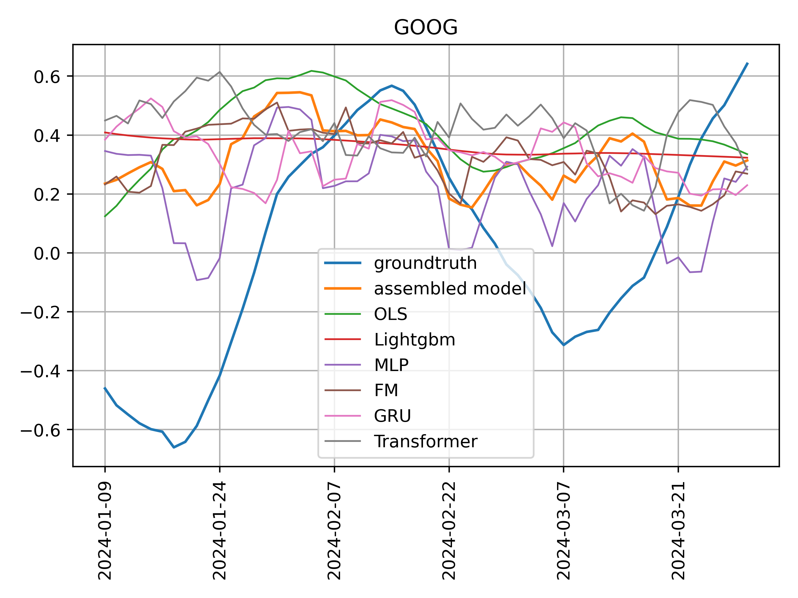
2. A high IC is not enough. 
This project is different from my previous alpha research. 
In alpha research, a signal with a high IC has good prediction and money-making ability. 
But as can be seen from the above figure, although the IC is very high, sometimes the predicted value does not follow the true value very well.
For example, for GME, the IC can be as high as 0.66, which is a very high value in alpha.
But it does not model the decrease of correlation in January and February. 
I think this problem may be due to IC screening of the factors I used in factor selection part.
Perhaps there are other selection metric for time series prediction problems, not just IC.
At the same time, after I have more experience in absolute numerical prediction of time series, I may be able to improve this problem.
3. The difficulty of prediction varies for different stocks.

By the way, here are some thoughts on the prediction goal of this project, that is, the correlation in the next two months.
if it can be predicted very accurately, then cross-product arbitrage strategies may be designed based on it.