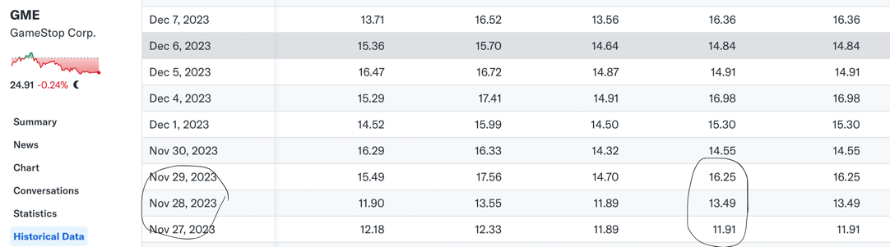

# Introduction

Here is the overall content of project 3, abbreviated as P3.

P3 requires me to predict a novel and self-proposed target. 
Thanks to the consideration of my past experiences and allowing me to design a signal for stocks.
I propose an alpha signal for long-short hedge using the datas in project2. 
This means I am going to design an alpha signal based on GOOG, AMZN, JPM, GME, XOM and SPY.
On each day, three stocks are longed while the other three are shorted.
Here I regard SPY index as a stock.
And I just use the price data.

This idea is exactly what I mentioned in the interview, 
that is the relationship based alpha idea researched in Lingjun, Luoshu and Qube.

The key point is regarding each stock as a node in a directed graph 
and using graph structure learning algorithm to construct an adjecnt matrix.
This matrix represents the relationship between each other. It is asymmetric.
Then it is assumed that each stock will follow the index and has an unit one movement.
Finally I use this matrix to modify the unit one movement and get their alpha signals. 
The key formula is $\hat{y}=Wy$, where $W$ is the matrix, $y$ is the base alpha 
and $\hat{y}$ is the improved alpha.
Here I use unit one to refer to $y$.

By the way, this idea is an unsupervised algorithm which means 
I just need historical datas rather than fitting the future alpha.

## Content
1. 0data_download.py for downloading the needed datas from 
2. 1data_clean.py for cleaning raw factors
3. 2data_preprocess.py for calculating the alpha signal by z-score operation
4. 3graph_signal_generate.py for learning the matrix using graph structure learning based algorithm 
and generating final aloha signal. 
5. 4signal_backtest.py for backtesting the predicted alpha signal using corresponding metrics

# Run the code
Run the .py files step by step from 0 to 4 according to the number in the script name.

# Download datas
Same as P2.

# Clean datas
Same as P2.

# Preprocess factors
I calculate the future return and use z-score operation to normalize return 
and obtain the target alpha signal.

It is worthy mentioned that 
there are long-term and short-term relationships between stocks. 
For different markets, the difficulty of prediction at different frequencies is different. 
For example, in China market, long-term stock relationships such as 5 days are best signals。
But in Japan, 2-day relationship based alpha is the best. 
Here for US stocks, I use 3-day alpha. 
There may be better frequency, but here is just to illustrate the idea and not to do more research on searching the best frequency.

# Learn the matrix  and generate the signal signal.
Here I used Huawei's open source causal structure graph learning tool called gcastle.
Its github link is _https://github.com/huawei-noah/trustworthyAI/tree/master/gcastle_. 

I made some personal improvements to this code. 
Here are some algorithms based on notears mentioned in the interview.
Among them, Golem is the fastest and most stable according to my previous experiments.

To avoid look-ahead information, the data for the last three days before day T 
cannot be used for learning the matrix on day T.

I use past 6 days' 3-day alpha return as features of each stock.
Then I feed this to algorithm and learn the adjacent matrix using Golem.
The threshold is set to 0.3 which is reasonable according to my past experiences.

After I get a matrix, I use $\hat{y}=Wy$ to get alpha signal $\hat{y}$.
Then I rank this signal and the highest three stocks are longed while the other three are shorted.
Their positions are equally allocated.

In fact, allocating position according to alpha value will yield higher returns.
But more information such as turnover rate needs to be considered.
So here I use equal weight allocation just to illustrate the idea.

# Backtest signals
For an alpha signal, the most common and important three metrics to evlaute the signal are
the sharp ratio of signal, the IC with groundtruth signal and daily pnl.

The ideal backtest result is shown in the following figure.

It is a good alpha signal in US stock since what we use is just price data.
If more volume, price and fundamental data are introduced, 
we will get better relationships and pnl.
As for two big dropdown marked with red circles happened on 21/03/2023 and 27/11/2023.
The reason is GME had some big sudden movements on these two days as shown in the following figure.
And I predict wrong long or short direction about this stock leading to a big dropdown.

This problem will be improved when the number of indicators increases, 
that is, the position of a single product will not be too large. 
Therefore the impact of individual stock fluctuations will be reduced.

In general, the alpha signal I predict finds the parts of these six stocks that are worth going long and short, 
and achieves stable profits after hedging the market absolute movement.

Moreover, the above three projects were completed in two weekends since I still have some work on weekdays.
If you want to know more details about any part, 
please feel free to contact me!